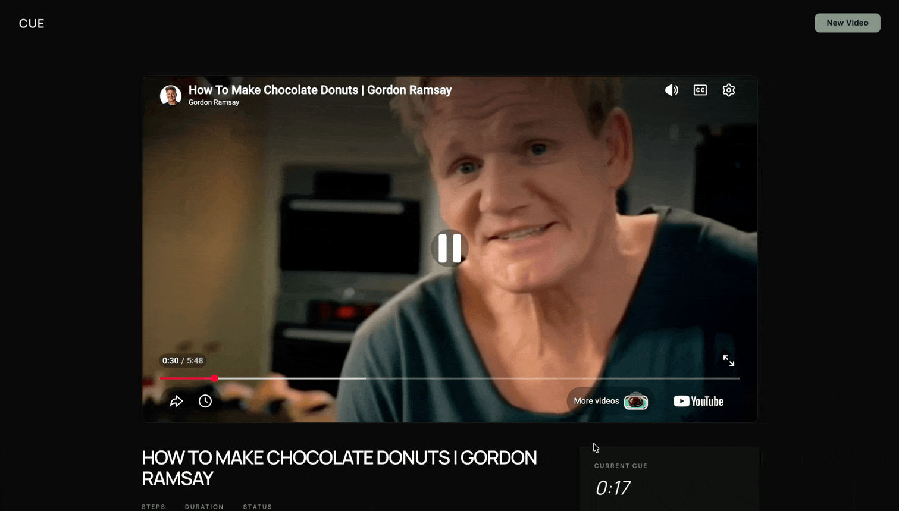

# CUE

CUE indexes cooking videos for key instructional moments. Paste a YouTube URL and get a timestamped, interactive timeline of every ingredient addition, technique, measurement, and timing cue — synced to the video in real time.

### Home Page


### Video Player
<div align="left">
  
</div>

## How it works

1. **Download** — yt-dlp fetches the video
2. **Extract audio** — ffmpeg normalizes to 16kHz mono PCM for Whisper
3. **Transcribe** — mlx-whisper (Apple Silicon optimized) produces word-level segments
4. **Extract frames** — ffmpeg samples 1 frame/sec; CLIP scores each frame for visual activity using zero-shot prompt pairs ("hands demonstrating a technique" vs. "talking head")
5. **Detect moments** — sentence-transformers embeds each transcript segment and computes cosine similarity against tutorial-register anchor phrases; a moment is kept if its audio score exceeds a strong threshold, or clears a weaker threshold and is visually corroborated by CLIP
6. **Deduplicate** — content-aware dedup using embedding similarity + time proximity
7. **Stream** — FastAPI SSE endpoint pushes status events and detected moments to the frontend as the pipeline runs

## Stack

**Backend:** Python 3.11, FastAPI, Metaflow, mlx-whisper, sentence-transformers (`all-MiniLM-L6-v2`), CLIP (`openai/clip-vit-base-patch32`), yt-dlp, ffmpeg

**Frontend:** React 19, Vite, Tailwind CSS 4, Framer Motion, React Router 7, YouTube IFrame API

## Setup

### Prerequisites

- Python 3.11+
- Node.js 18+
- ffmpeg (`brew install ffmpeg`)
- Apple Silicon Mac (mlx-whisper is MPS-accelerated; swap for `faster-whisper` on other hardware)

### Backend

```bash
pip install -e .
```

### Frontend

```bash
cd my-app
npm install
```

## Running

Start both servers in separate terminals:

```bash
# Terminal 1 — API
uvicorn api:app --reload --port 8000

# Terminal 2 — Frontend
cd my-app && npm run dev
```

Open [http://localhost:5173](http://localhost:5173), paste a YouTube cooking video URL, and hit enter.

You can also run the pipeline directly without the UI:

```bash
python -u pipeline.py run --video_url "https://www.youtube.com/watch?v=..."
```

Results are saved as `results_{run_id}.json`.

## Evaluation

The `eval/` directory contains a harness for comparing pipeline versions against hand-labeled ground truth (±10 second tolerance window):

```bash
python eval/eval.py
```

This runs v1 (regex-only) and v2 (semantic embeddings) against the same video and prints precision, recall, F1, and per-version miss analysis.

## Pipeline versions

| Version | Approach | File |
|---------|----------|------|
| v1 | Regex pattern matching on ingredient/technique/timing keywords | `pipeline_v1.py` |
| v2 | Semantic similarity via sentence-transformers | `pipeline_v2.py` |
| v3 (current) | Multimodal: audio embeddings + CLIP visual fusion | `pipeline.py` |
